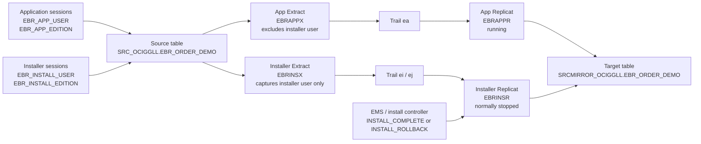

# Edition-Aware Upgrade Control with Oracle GoldenGate

How to control installer-edition replication during Oracle EBR-based application upgrades.

## What GoldenGate Supports with EBR

Oracle GoldenGate supports Oracle Database Edition-Based Redefinition (EBR), which allows the database component of an application to be upgraded while the application remains in use. In an EBR-enabled application, a new edition can be created for the upgrade while existing application sessions continue to use the current edition.

GoldenGate support is strongest for edition-related DDL and editioned objects:

- GoldenGate can capture `CREATE EDITION` and `DROP EDITION` DDL.
- Edition DDL is categorized as `OBJTYPE EDITION`, so it can be included or excluded through DDL filtering.
- When redo includes the edition name for an editioned object DDL, Replicat can switch its session edition before applying that DDL.
- Replicat does not need its own schema to be edition-enabled in order to apply DDL to editioned objects in another schema.

The important limitation for this use case is DML. Application DML ultimately changes the base table. Redo for that base-table DML does not provide a simple GoldenGate routing attribute that says, "this row change came from application edition A" or "this row change came from installer edition B." If downstream systems need that business distinction, the implementation must add a control pattern outside ordinary table-level replication.

In our test, we used the table column `SESSION_EDITION` only as proof of the session edition that performed the DML. We did not rely on it for GoldenGate routing.

Sources:

- Oracle GoldenGate documentation: [Using Edition-Based Redefinition](https://docs.oracle.com/en/database/goldengate/core/26/coredoc/extract-oracle-using-edition-based-redefinition.html)
- Oracle Database documentation: [Using Edition-Based Redefinition](https://docs.oracle.com/en/database/oracle/oracle-database/26/adfns/editions.html)
- Oracle EBR overview: [Edition-Based Redefinition](https://www.oracle.com/database/technologies/high-availability/ebr.html)

## Business Problem

One of the largest airline customers uses Oracle GoldenGate to capture database changes and distribute them to downstream systems. Their application is moving to an EBR-enabled installation model.

During an upgrade:

- Existing users continue to run on the current application edition.
- The installer connects to a new installation edition.
- Structural changes may be implemented by keeping the current column, adding a new column, moving or transforming data, using editioning views, and using crossedition triggers.
- Both application and installer sessions can generate DML on the same base table during the installation window.

The customer requirement is subtle but important:

- Current application DML must continue to replicate immediately.
- Installer-edition DML must be captured, but it should only be applied downstream if the installation completes successfully.
- If the installation is rolled back or aborted, the installer changes must not be applied downstream.

GoldenGate cannot infer installation success or failure from redo. The installation controller must tell the replication layer what happened.

## Solution Pattern

The solution is to split replication into two GoldenGate paths and control the installer path explicitly.



The app path is always active:

- `EBRAPPX` captures table changes except those generated by `EBR_INSTALL_USER`.
- `EBRAPPR` applies them continuously to `SRCMIRROR_OCIGGLL`.

The installer path is gated:

- `EBRINSX` captures only transactions from `EBR_INSTALL_USER`.
- `EBRINSR` remains stopped during the installation window.
- EMS-style install markers or an external controller decide the outcome.

Outcome handling:

| Installation outcome | Replication action |
| --- | --- |
| Successful installation | Start `EBRINSR` and apply the held installer trail. |
| Rollback or aborted installation | Keep `EBRINSR` stopped, discard or skip the installer trail, and recreate the installer path from the current end for the next run. |

Important implementation note: a stopped Replicat cannot read a marker in its own trail and start itself. In production, EMS or an external controller should observe the install event and call the GoldenGate Admin API.

## Demo Environment

| Item | Value |
| --- | --- |
| Database | `SOURCE_DB` |
| GoldenGate deployment | `OGG_DEPLOYMENT` |
| Source schema | `SRC_OCIGGLL` |
| Target schema | `SRCMIRROR_OCIGGLL` |
| Table | `EBR_ORDER_DEMO` |
| App edition | `EBR_APP_EDITION` |
| Installer edition | `EBR_INSTALL_EDITION` |
| App DML user | `EBR_APP_USER` |
| Installer DML user | `EBR_INSTALL_USER` |

GoldenGate processes:

| Process | Type | Trail | Purpose | Runtime state |
| --- | --- | --- | --- | --- |
| `EBRAPPX` | Integrated Extract | `ea` | Capture normal app DML | Running |
| `EBRAPPR` | Nonintegrated Replicat | `ea` | Apply normal app DML | Running |
| `EBRINSX` | Integrated Extract | `ei`, later `ej` | Capture installer DML | Running |
| `EBRINSR` | Nonintegrated Replicat | `ei`, later `ej` | Apply installer DML only after success | Stopped by default |

ATP note: integrated Replicat requires XStream In, which is not supported in this Autonomous Database test. The demo therefore uses integrated Extract and nonintegrated Replicat with checkpoint table `SRCMIRROR_OCIGGLL.GGCHKPT`.

## Single Demo Table

The test intentionally uses one table only:

```sql
create table SRC_OCIGGLL.EBR_ORDER_DEMO
(
  ORDER_ID        number primary key,
  STATUS_CODE     varchar2(10),
  STATUS_TEXT     varchar2(50),
  SESSION_EDITION varchar2(128),
  INSTALL_RUN_ID  varchar2(30),
  UPDATED_BY      varchar2(128),
  UPDATED_AT      timestamp
);
```

The target table has the same structure in `SRCMIRROR_OCIGGLL`.

The columns `SESSION_EDITION`, `INSTALL_RUN_ID`, and `UPDATED_BY` are evidence columns for the test. In a production design, the equivalent control metadata could be written to a dedicated control table or emitted by the installer workflow.

## Step-by-Step Guide

### 1. Enable EBR and Create Test Objects

Run the setup script as an admin user:

```sql
@sql/00_setup_ebr_single_table.sql
```

The script creates:

- Editions `EBR_APP_EDITION` and `EBR_INSTALL_EDITION`
- Users `EBR_APP_USER` and `EBR_INSTALL_USER`
- Source table `SRC_OCIGGLL.EBR_ORDER_DEMO`
- Target table `SRCMIRROR_OCIGGLL.EBR_ORDER_DEMO`
- Supplemental logging on the source table

### 2. Create GoldenGate Processes

Create the checkpoint table once:

```text
DBLOGIN USERIDALIAS srcAtp DOMAIN OracleGoldenGate
ADD CHECKPOINTTABLE SRCMIRROR_OCIGGLL.GGCHKPT
```

Create the processes through the Admin API helper:

```sh
source env/ebr.env
python3 -m pip install -r ogg/requirements.txt
python3 ogg/create_ebr_processes.py
```

Start only the app path and installer Extract:

```text
START EXTRACT EBRAPPX
START REPLICAT EBRAPPR
START EXTRACT EBRINSX

Do not start REPLICAT EBRINSR yet.
```

### 3. Verify the Starting GoldenGate State

Expected process state:

| Process | Expected state |
| --- | --- |
| `EBRAPPX` | Running |
| `EBRAPPR` | Running |
| `EBRINSX` | Running |
| `EBRINSR` | Stopped |

This means normal application DML is flowing while installer DML is being captured but not applied.

## Test Case 1: Successful Installation

### Step 1: Insert Normal Application Data

Connect as `EBR_APP_USER`, set the app edition, and insert the row:

```sql
@sql/01_app_edition_dml.sql
```

Expected result:

| Side | ORDER_ID | STATUS_CODE | STATUS_TEXT | SESSION_EDITION | UPDATED_BY |
| --- | ---: | --- | --- | --- | --- |
| SOURCE | 1 | N | null | EBR_APP_EDITION | EBR_APP_USER |
| TARGET | 1 | N | null | EBR_APP_EDITION | EBR_APP_USER |

The app path replicated the row immediately.

### Step 2: Run Installer DML While Installer Replicat Is Stopped

Connect as `EBR_INSTALL_USER`, set the installer edition, and update the row:

```sql
@sql/04_install_start_marker.sql
@sql/02_install_edition_dml.sql
```

Expected result before starting `EBRINSR`:

| Side | ORDER_ID | STATUS_CODE | STATUS_TEXT | SESSION_EDITION | INSTALL_RUN_ID | UPDATED_BY |
| --- | ---: | --- | --- | --- | --- | --- |
| SOURCE | 1 | N | NEW_STATUS_VALUE | EBR_INSTALL_EDITION | RUN_001 | EBR_INSTALL_USER |
| TARGET | 1 | N | null | EBR_APP_EDITION | null | EBR_APP_USER |

This proves the installer change is captured separately and held back from the target.

### Step 3: Mark Installation Complete and Apply Installer Trail

Write the completion marker:

```sql
@sql/05_install_complete_marker.sql
```

Start the installer Replicat through the control script:

```sh
source env/ebr.env
python3 ogg/install_outcome.py complete
```

Expected GoldenGate message:

```text
Replicat group EBRINSR started.
```

Expected result after `EBRINSR` applies the held installer trail:

| Side | ORDER_ID | STATUS_CODE | STATUS_TEXT | SESSION_EDITION | INSTALL_RUN_ID | UPDATED_BY |
| --- | ---: | --- | --- | --- | --- | --- |
| SOURCE | 1 | N | NEW_STATUS_VALUE | EBR_INSTALL_EDITION | RUN_001 | EBR_INSTALL_USER |
| TARGET | 1 | N | NEW_STATUS_VALUE | EBR_INSTALL_EDITION | RUN_001 | EBR_INSTALL_USER |

The successful installer changes are now visible on the target.

## Test Case 2: Rollback Installation

### Step 1: Seed a Second App Row

Connect as `EBR_APP_USER` and insert a second row:

```sql
@sql/07_app_seed_rollback_row.sql
```

Expected result:

| Side | ORDER_ID | STATUS_CODE | STATUS_TEXT | SESSION_EDITION | UPDATED_BY |
| --- | ---: | --- | --- | --- | --- |
| SOURCE | 2 | N | null | EBR_APP_EDITION | EBR_APP_USER |
| TARGET | 2 | N | null | EBR_APP_EDITION | EBR_APP_USER |

### Step 2: Run Installer DML for an Installation That Will Be Aborted

Connect as `EBR_INSTALL_USER` and update the second row:

```sql
@sql/08_install_rollback_dml.sql
@sql/06_install_rollback_marker.sql
```

Expected result while `EBRINSR` remains stopped:

| Side | ORDER_ID | STATUS_TEXT | SESSION_EDITION | INSTALL_RUN_ID | UPDATED_BY |
| --- | ---: | --- | --- | --- | --- |
| SOURCE | 2 | ABORTED_STATUS_VALUE | EBR_INSTALL_EDITION | RUN_ROLLBACK_001 | EBR_INSTALL_USER |
| TARGET | 2 | null | EBR_APP_EDITION | null | EBR_APP_USER |

The source shows the installer change, but the target still has the app-edition state.

### Step 3: Skip the Aborted Installer Trail

Apply the rollback outcome:

```sh
source env/ebr.env
python3 ogg/install_outcome.py rollback
```

Then recreate the installer path from the current end on a fresh trail:

```sh
python3 ogg/reset_install_path_after_rollback.py --new-trail ej
```

The script performs the practical skip:

- Stops `EBRINSR`
- Stops `EBRINSX`
- Deletes the old installer Replicat and Extract
- Recreates `EBRINSX` from `now` on trail `ej`
- Recreates `EBRINSR` against trail `ej`
- Starts `EBRINSX`
- Leaves `EBRINSR` stopped for the next installation window

Expected final process state:

| Process | Expected state | Notes |
| --- | --- | --- |
| `EBRAPPX` | Running | App capture continues |
| `EBRAPPR` | Running | App apply continues |
| `EBRINSX` | Running | Recreated on trail `ej` |
| `EBRINSR` | Stopped | Gated for next installer run |

### Step 4: Prove the Aborted Change Was Not Applied

As a final proof, starting the newly recreated `EBRINSR` on fresh trail `ej` does not apply the old aborted transaction:

| Side | ORDER_ID | STATUS_TEXT | SESSION_EDITION | INSTALL_RUN_ID | UPDATED_BY |
| --- | ---: | --- | --- | --- | --- |
| SOURCE | 2 | ABORTED_STATUS_VALUE | EBR_INSTALL_EDITION | RUN_ROLLBACK_001 | EBR_INSTALL_USER |
| TARGET | 2 | null | EBR_APP_EDITION | null | EBR_APP_USER |

The aborted installer change remains skipped.

## Why This Pattern Works

The design does not try to make GoldenGate infer session edition for DML. Instead, it uses stable operational signals:

- A dedicated installer database user separates installer transactions from app transactions.
- Separate Extract and Replicat paths isolate capture and apply.
- Installer apply is controlled by the installation outcome.
- Successful installs apply the held installer trail.
- Failed installs skip the held installer trail and reset the installer path for the next run.

This maps cleanly to real upgrade operations because the installer already knows whether the installation completed or rolled back. GoldenGate should not be asked to infer that business state from redo.

## Files in the Demo

| Path | Purpose |
| --- | --- |
| `sql/00_setup_ebr_single_table.sql` | Creates editions, users, source/target table, grants, and supplemental logging |
| `sql/01_app_edition_dml.sql` | Inserts app-edition row `ORDER_ID=1` |
| `sql/02_install_edition_dml.sql` | Applies successful installer-edition update for `ORDER_ID=1` |
| `sql/03_verify_source_target.sql` | Compares source and target rows |
| `sql/04_install_start_marker.sql` | Writes `INSTALL_START` marker |
| `sql/05_install_complete_marker.sql` | Writes `INSTALL_COMPLETE` marker |
| `sql/06_install_rollback_marker.sql` | Writes `INSTALL_ROLLBACK` marker |
| `sql/07_app_seed_rollback_row.sql` | Inserts app-edition row `ORDER_ID=2` |
| `sql/08_install_rollback_dml.sql` | Applies aborted installer-edition update for `ORDER_ID=2` |
| `ogg/create_ebr_processes.py` | Creates the app and installer GoldenGate paths |
| `ogg/install_outcome.py` | Starts or holds installer Replicat based on install outcome |
| `ogg/reset_install_path_after_rollback.py` | Recreates installer path from `now` on a fresh trail after rollback |
| `ogg/*.prm` | Parameter examples for Extract and Replicat processes |
| `env/ebr.env.example` | Environment template with non-sensitive placeholders |

## Takeaway

Oracle GoldenGate supports EBR, but DML routing by session edition is not the right control point. For EBR-based application upgrades where installer DML must only be released after success, use a separate installer capture path and let the installation workflow drive the apply decision.

For the airline use case, this gives three guarantees:

- Application changes keep flowing during the upgrade window.
- Installer changes are captured and available if the upgrade succeeds.
- Installer changes are skipped cleanly if the upgrade is rolled back.
